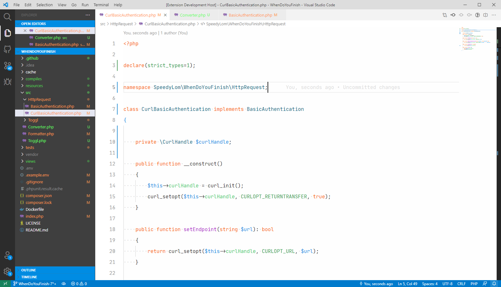

# dislexic

A high contrast brightly coloured [Visual Studio Code](https://code.visualstudio.com/) theme for dyslexics with astigmatism.



## Usage

Within `code` press <kbd>ctl</kbd>/<kbd>command</kbd> + <kbd>shift</kbd> + <kbd>p</kbd> to launch the command palette then run:

```
ext install dislexic
```

## Contributing
Please open an issue to make suggestions.

## License
[MIT License](https://github.com/SpeedyLom/dislexic-vscode/blob/master/LICENSE)
