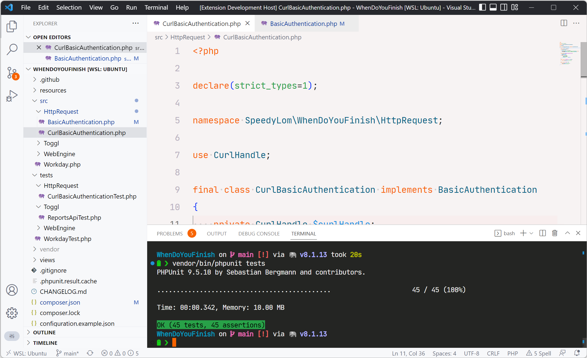

# dislexic

A brightly coloured [Visual Studio Code](https://code.visualstudio.com/) theme set on a light red background for dyslexics (with optional astigmatism).



## Usage

Within `code` press <kbd>ctl</kbd>/<kbd>command</kbd> + <kbd>shift</kbd> + <kbd>p</kbd> to launch the command palette then run:

```shell
ext install dislexic
```

## Recommendations

Below are some recommendations on how to improve your reading experience while using this theme.

### Font

Use a font that has simple well formed characters such as [JetBrains
Mono](https://www.jetbrains.com/lp/mono/), I personally use the [Nerd Font](https://www.nerdfonts.com/) version.

```json
"editor.fontFamily": "'JetBrainsMono NF', Consolas, 'Courier New', monospace"
```

### Font Size

A larger font will help when trying to distinguish between letters and reduce some cognitive load.

```json
"editor.fontSize": 18
```

### Line Height

Increase the gap between lines with line height, `2` gives a good balance with the recommend font.

```json
"editor.lineHeight": 2
```

## Contributing
Please open an issue to make suggestions.

## License
[MIT License](https://github.com/SpeedyLom/dislexic-vscode/blob/master/LICENSE)
